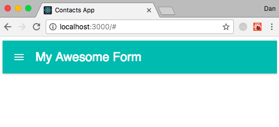

Here I make a walkthrough of how to make a Contacts app in React which can be found at

I will walk through, in detail, the steps I went through to produce the final version of the app found on my GitHub page [here](https://github.com/danhagg/contacts-app).

Firstly, make on the GitHub website, create a new repository called "contacts-app".

Make a directory locally also called ""contacts app to store the app. Then cd into the directory and link the directory to GitHub.
```
echo "# ToDoList" >> README.md
git init
git add README.md
git commit -m "first commit"
git remote add origin git@github.com:danhagg/contacts-app.git
git push -u origin master
```

### v0.1
Let's make a new git branch for production
```
git branch v0.1
git checkout v0.1
```

Also delete all the css code in `App.css`. So, now this setup is basically the start point for any React App that we wish to build.

Locally, cd into `contacts` and install these plugins for use within the app. They help us use the material-ui components and make our app more sensitive to touch screen behavior.
```
cd contacts
npm install material-ui --save
npm install react-tap-event-plugin --save
```

Find the `index.html` file in the `public` directory. Strip out all annotations to leave the following code.

```html
<!DOCTYPE html>
<html lang="en">
  <head>
    <meta charset="utf-8">
    <meta name="viewport" content="width=device-width, initial-scale=1, shrink-to-fit=no">
    <meta name="theme-color" content="#000000">

    <link rel="manifest" href="%PUBLIC_URL%/manifest.json">
    <link rel="shortcut icon" href="%PUBLIC_URL%/favicon.ico">

    <title>Project Manager</title>
  </head>
  <body>

    <div id="root"></div>

  </body>
</html>
```

Note that the only `div` has id `root`. The entire app will be passed into, and displayed, via this `div`.

All of React stuff goes in the `src` directory. The `index.js` looks like this.

```js
import React from 'react';
import ReactDOM from 'react-dom';
// import App component from App.js
import App from './App';
import registerServiceWorker from './registerServiceWorker';

// App component will be rendered in the root div
ReactDOM.render(<App />, document.getElementById('root'));
registerServiceWorker();
```

Both the `index.js` and `index.html` files remain pretty untouched from this point forwards. All the development takes place by building components in separate `.js` files and feeding the output of those files into our `App.js` file, which looks like this.

```js
import React, { Component } from 'react';
import './App.css';

// EVERYTHING rendered has to be within ONE element
class App extends Component {
  render () {
    return (
      <div className='App'>
        My App
      </div>
    );
  }
}

export default App;
```

So... Lets begin building
Add to `index.js`
`import injectTapEventPlugin from 'react-tap-event-plugin';`
This allow the react app to be much more responsive to touches/taps on mobile screens.

Next, we will empower our App.js to import react components, we will import our first component, a bar, and color it with the material-ui theme picker.

`App.js`
```js
import React, { Component } from 'react';
import './App.css';
// Import from MuiThemeProvider (http://www.material-ui.com/)
import MuiThemeProvider from 'material-ui/styles/MuiThemeProvider';
// import ContactForm from './Components/ContactForm';
// Import the AppBar from MUI
import AppBar from 'material-ui/AppBar';

// import color theme from MUI
import getMuiTheme from 'material-ui/styles/getMuiTheme';
import {teal300} from 'material-ui/styles/colors';

// create theme, primary and secondary colors
const theme = getMuiTheme({
  palette: {primary1Color: teal300}
});

class App extends Component {
  render () {
    return (
      <MuiThemeProvider muiTheme={theme}>
        <AppBar title='My Awesome Form' />
      </MuiThemeProvider>
    );
  }
}
export default App;
```
So, if we hit npm start in the terminal in the local contacts folder we should get in the browser, localhost:3000 the following...



Lets,
1. Push this local version (v0.1) to GitHub
2. Make, accept and merge a pull request on GitHub
3. Update local master to GitHub master
4. Make a local v0.2 and checkout this version
This sequence of events will be repeated between each version and should be used as a reference at the end of each version.


1. Push this local version (v0.1) to GitHub
```
git add -A
git commit -m"App bar up n running"
git push --set-upstream origin v0.1
```

2. Make, accept and merge a pull request on GitHub
  - in your GitHub repository, make a pull request, compare master to v0.1, confirm, and merge. This makes your GitHub master repository up to date with v0.1.

3. Update local master to GitHub master
```
git checkout master
git pull
```

4. Make a local v0.2 and checkout this version
```
git branch v0.2
git checkout v0.2
```

Made the app accept data, clear, etc based upon changes in here... needs annotating
```js
import React, { Component } from 'react';
import {Card, CardActions, CardTitle, CardText} from 'material-ui/Card';
import RaisedButton from 'material-ui/RaisedButton';
import TextField from 'material-ui/TextField';
import SelectField from 'material-ui/SelectField';
import MenuItem from 'material-ui/MenuItem';
import uuid from 'uuid';

class ContactForm extends Component {
    constructor(props) {
        super(props);
        this.state = {name: '',
                            email: '',
                            phone: '',
                            address: '',
                            city: '',
                            state: '',
                            zip: '',
                            contacts: []
        }
    }

    update_state(event, key) {
        this.setState({[key]: event.target.value});
    }

    //
    handle_submit(event) {
        console.log('Submitted: ', this.state);
        //create a unique id for each contact using the 'uid' package.
        let contact = {
            key: uuid.v4(),
            name: this.state.name,
            email: this.state.email,
            phone: this.state.phone,
            address: this.state.city,
            state: this.state.state,
            zip: this.state.zip,
        };
        //you cannot change the state directly so you must create a temporary array into which you can push contact
        let tempArray = this.state.contacts;
        tempArray.push(contact);
        //reset the text fields to empty when the submit button is pushed.
        this.setState({contacts: tempArray,
                                name: '',
                                email: '',
                                phone: '',
                                address: '',
                                city: '',
                                state: '',
                                zip: ''});
        event.preventDefault();
    }

    //create a raised button by importing the RaisedButton component from Material-UI
    //change 'defaultvalue' to 'value'.
    //renderList is called within the <ol> and generates a list of contacts
    render() {
        let renderList = this.state.contacts.map((c)=>{
            return (
                <li key={c.key}>{c.name}: {c.address}</li>
            )
        })
        return (
            <div>
                <Card className="md-card">
                    <form onSubmit={event => this.handle_submit(event)}>
                        <CardTitle title="Add Contact" subtitle=""/>
                        <CardText>
                            <TextField floatingLabelText="Name"
                                value={this.state.name}
                                onChange={event => this.update_state(event, 'name')}
                                hintText="Name"
                            />
                            <br />
                            <TextField floatingLabelText="Email"
                                value={this.state.email}
                                onChange={event => this.update_state(event, 'email')}
                                hintText="Email"
                            />
                            <br />
                            <TextField floatingLabelText="Phone"
                                value={this.state.phone}
                                onChange={event => this.update_state(event, 'phone')}
                                hintText="Phone"
                            />
                            <br />
                            <TextField floatingLabelText="Address"
                                value={this.state.address}
                                onChange={event => this.update_state(event, 'address')}
                                hintText="Email"
                            />
                            <br />
                            <TextField floatingLabelText="City"
                                value={this.state.city}
                                onChange={event => this.update_state(event, 'city')}
                                hintText="City"
                            />
                            <br />
                            <TextField floatingLabelText="State"
                                value={this.state.state}
                                onChange={event => this.update_state(event, 'state')}
                                hintText="State"
                            />
                            <br />
                            <TextField floatingLabelText="Zip"
                                value={this.state.zip}
                                onChange={event => this.update_state(event, 'zip')}
                                hintText="Zip"
                            />
                            <br />
                        </CardText>
                        <CardActions>
                            <RaisedButton label="Submit" type="submit" primary={true}/>
                        </CardActions>
                    </form>
                    <ol>
                        {renderList}
                    </ol>
                </Card>
            </div>

        )

    }
}
export default ContactForm;
```
